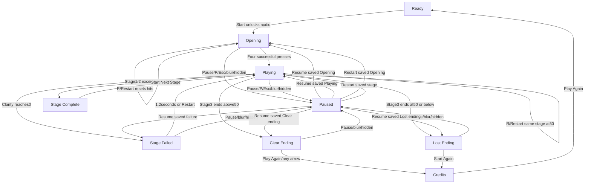

# State flow

```mermaid
flowchart TD
 R[Ready] -->|Start unlocks audio| O[Opening]
 O -->|Four successful presses| P[Playing]
 O -->|Pause/P/Esc/blur/hidden| Z[Paused]
 P -->|Pause/P/Esc/blur/hidden| Z
 Z -->|Resume saved Opening| O
 Z -->|Resume saved Playing| P
 Z -->|Restart saved Opening| O
 Z -->|Restart saved stage| P
 O -->|R/Restart resets hits| O
 P -->|R/Restart same stage at50| P
 P -->|Clarity reaches0| F[Stage Failed]
 F -->|1.2seconds or Restart| P
 F -->|Pause/blur/hidden| Z
 Z -->|Resume saved failure| F
 P -->|Stage1/2 excerpt complete| S[Stage Complete]
 S -->|Start Next Stage| P
 P -->|Stage3 ends above50| C[Clear Ending]
 P -->|Stage3 ends at50 or below| L[Lost Ending]
 C -->|Play Again/any arrow| K[Credits]
 L -->|Start Again| K
 C -->|Pause/blur/hidden| Z
 L -->|Pause/blur/hidden| Z
 Z -->|Resume saved Clear ending| C
 Z -->|Resume saved Lost ending| L
 K -->|Play Again| R
```

Loading overlay: Retry on failure or Back to title. Stale loads are discarded after reset. Every ending has a visible next action; credits always precede Ready.
